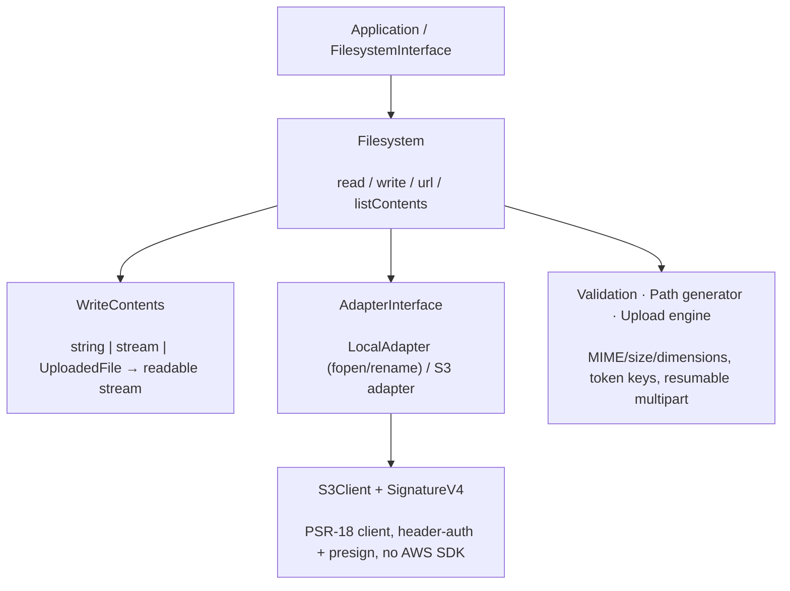

# phpdot/filesystem

Coroutine-safe, PSR-native file storage. One `FilesystemInterface` spans local disk and S3-compatible
backends (AWS S3, Cloudflare R2, MinIO, DigitalOcean Spaces) through a hand-rolled PSR-18 + Signature V4
client — no AWS SDK. Bodies flow as PSR-7 streams with bounded memory, uploads are resumable, validation
is built in, and the server (not the browser) picks where bytes land.

## Table of Contents

- [Requirements](#requirements)
- [Installation](#installation)
- [Usage](#usage)
- [Architecture](#architecture)
- [Realtime (MySQL binlog)](#realtime-mysql-binlog)
- [Testing](#testing)
- [License](#license)

## Requirements

| Requirement | Constraint |
|---|---|
| PHP | `>= 8.5` |
| `ext-fileinfo` | `*` |
| `ext-hash` | `*` |
| `league/mime-type-detection` | `^1.16` |
| `phpdot/console` | `^0.2` |
| `psr/event-dispatcher` | `^1.0` |
| `psr/http-client` | `^1.0` |
| `psr/http-factory` | `^1.0` |
| `psr/http-message` | `^2.0` |
| `psr/http-server-handler` | `^1.0` |
| `symfony/console` | `^8.0` |

Bring any PSR-17/PSR-18 implementation. `phpdot/container` is a dev-only suggestion
(the binding attributes are inert without it).

## Installation

```bash
composer require phpdot/filesystem
```

## Usage

```php
use Nyholm\Psr7\Factory\Psr17Factory;
use PHPdot\Filesystem\Adapter\LocalAdapter;
use PHPdot\Filesystem\Filesystem;
use PHPdot\Filesystem\FilesystemConfig;
use PHPdot\Filesystem\Write\WriteContents;

$psr17      = new Psr17Factory();
$adapter    = new LocalAdapter(new FilesystemConfig(root: '/var/storage'), $psr17);
$filesystem = new Filesystem($adapter, new WriteContents($psr17));

$filesystem->write('invoices/2026.pdf', $pdfBytes);   // string | PSR-7 stream | UploadedFile
$pdf = $filesystem->read('invoices/2026.pdf');
$url = $filesystem->url('invoices/2026.pdf');          // public or presigned, by visibility

foreach ($filesystem->listContents('invoices', deep: true) as $entry) {
    echo $entry->path(), PHP_EOL;
}
```

You talk to one interface; swap the backend by swapping one binding. In a PHPdot application the container
auto-binds `FilesystemInterface`, so the wiring above disappears.

Beyond read/write/list, the package adds a collect-all **validation** pipeline (MIME, size, extension,
image dimensions over a bounded prefix), a token **path generator** (`{date}/{uuid}/{hash}`…) so the
server picks the key, an optional **managed-files** layer that persists a `FileRecord` per file with
soft-delete and quarantine, and a tus-compatible **resumable upload** endpoint plus CLI uploader.

## Architecture

`Filesystem` is the operator — it drives an `AdapterInterface` (`LocalAdapter` native fopen/rename, or the
`S3` adapter over a PSR-18 + SigV4 client with no AWS SDK) and a `WriteContents` pipeline that collapses a
string, stream, or uploaded file into one readable stream. Validation, path generation, and the resumable
upload engine sit alongside, and I/O goes non-blocking automatically under Swoole without any
`ext-swoole` dependency.



## Realtime (MySQL binlog)

MySQL has no PostgreSQL-style WAL you can subscribe to, but it has the binary log, and it will push
it to anything that registers as a replica. `BinlogClient` does exactly that — handshake,
`COM_BINLOG_DUMP`, then decode — so row changes arrive **as they commit** instead of being polled
for. Because it reads the same log replication reads, it also sees writes made by other
applications, migrations and hand-run SQL, which an application-level event never will.

```php
use PHPdot\Filesystem\Realtime\BinlogClient;
use PHPdot\Filesystem\Realtime\BinlogConfig;

$client = new BinlogClient(new BinlogConfig(
    user:     'replicator',
    password: '…',
    tables:   'shop.orders, shop.customers',   // or 'shop.*', or '' for everything
));

foreach ($client->changes() as $change) {
    $change->kind;             // insert | update | delete
    $change->qualifiedName();  // "shop.orders"
    $change->primaryKey;       // ['id' => 99]
    $change->before;           // row as it was  (empty for an insert)
    $change->after;            // row as it became (empty for a delete)
    $change->changedColumns(); // ['status', 'total'] — updates only
}
```

`stream()` does the same and dispatches each `ChangeEvent` through PSR-14, so fanning out to
WebSockets, a queue, or cache invalidation is a listener rather than a rewrite. There is also a CLI
tail:

```bash
php bin/console realtime:watch --limit=20     # summary lines
php bin/console realtime:watch --json         # one JSON object per change
```

### Server requirements

| Setting | Required | Why |
|---|---|---|
| `log_bin` | `ON` | Without it there is no log to read. |
| `binlog_format` | `ROW` | `STATEMENT` logs SQL text, not row images. |
| `binlog_row_image` | `FULL` (recommended) | `MINIMAL` logs only changed columns, so `before`/`after` come back partial. |
| `binlog_row_metadata` | `FULL` (recommended) | Supplies column names, signedness and ENUM/SET labels. Without it columns decode positionally as `@0`, `@1`, … |
| `binlog_transaction_compression` | `OFF` | Compressed transaction payloads are refused rather than mis-decoded. |
| `binlog_row_value_options` | unset | `PARTIAL_JSON` is refused for the same reason. |

The account needs `REPLICATION SLAVE` and `REPLICATION CLIENT`, and `serverId` must be unique across
the topology — a duplicate id makes the server disconnect whichever replica registered first. The
client verifies `log_bin` and `binlog_format` before streaming and fails with a named setting rather
than decoding garbage.

### Delivery and resume

Delivery is **at-least-once**: the checkpoint advances only after a change has been handed to the
consumer, so a crash mid-handling replays that change rather than dropping it. Consumers must be
idempotent.

A `Checkpoint` carries both a binlog file/position and a GTID set, persisted atomically by
`LocalCheckpointStore` (rebind `CheckpointStoreInterface` for Redis, a table, or anything else). When
a GTID set is present the client resumes with `COM_BINLOG_DUMP_GTID`, which asks for "everything
except the transactions I already have" and therefore survives a failover to a different primary; a
file/position pair does not. Transport failures reconnect with exponential backoff, while a rejected
credential or an unsupported server setting propagates instead of spinning.

Values are decoded to shapes that survive `json_encode` without loss: `DECIMAL` as an exact decimal
string, temporal types in MySQL's canonical text form (`TIMESTAMP` rendered as the UTC instant it
actually stores), `BIGINT UNSIGNED` above `PHP_INT_MAX` as a string rather than a wrapped negative,
and `JSON` columns decoded from MySQL's binary tree format into PHP arrays.

I/O uses the native stream functions, so under Swoole the dump loop yields the coroutine instead of
blocking the worker — same as the rest of the package, with no `ext-swoole` dependency.

## Testing

```bash
composer install
composer test        # PHPUnit
composer analyse     # PHPStan, level max + strict rules
composer cs-check    # PHP-CS-Fixer
composer check       # All three
```

The unit suite (including the S3 client, signing vectors, and adapters against an in-memory HTTP client)
runs with no external services. The S3 integration suite connects to a real bucket and **skips unless AWS
credentials and `PHPDOT_S3_TEST_BUCKET` are set**.

## License

MIT.

**This repository is a read-only mirror**, generated by CI from
[phpdot/monorepo](https://github.com/phpdot/monorepo). [Pull requests](https://github.com/phpdot/monorepo/pulls)
and [issues](https://github.com/phpdot/monorepo/issues) belong in the monorepo.
